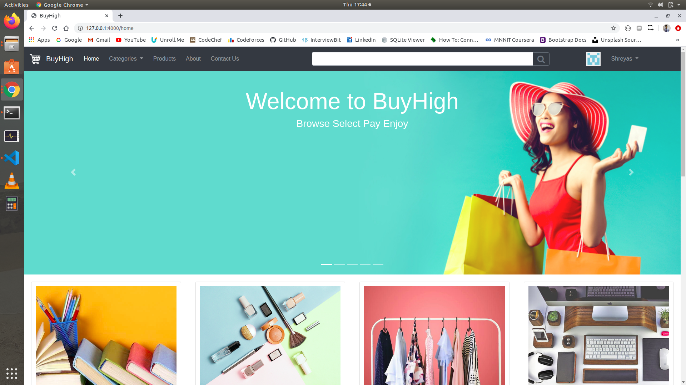
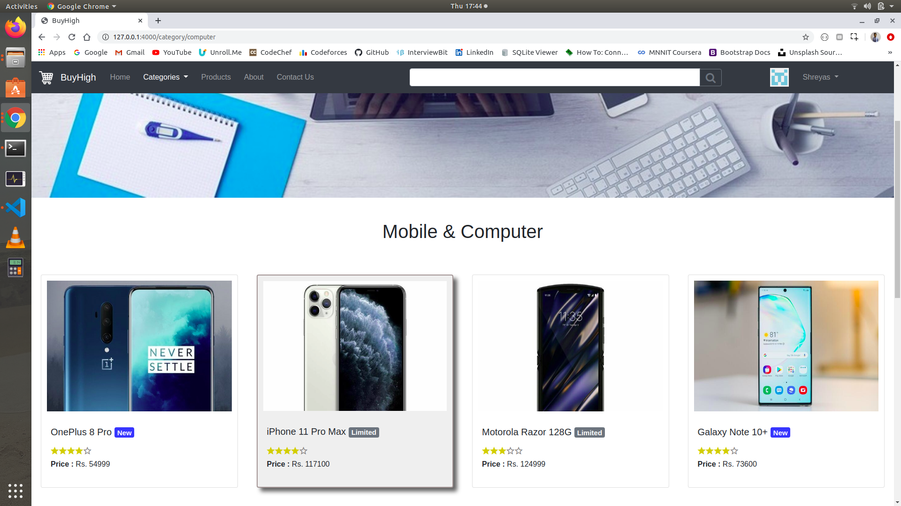
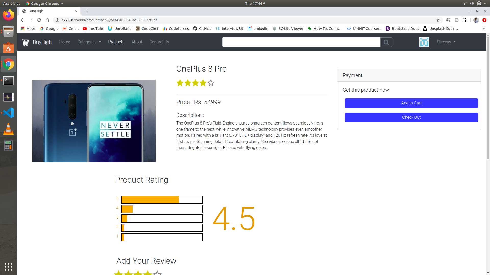
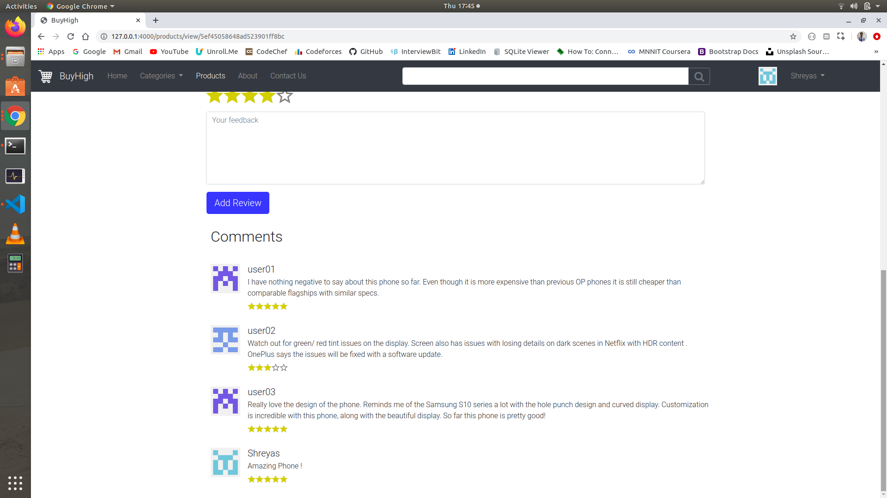
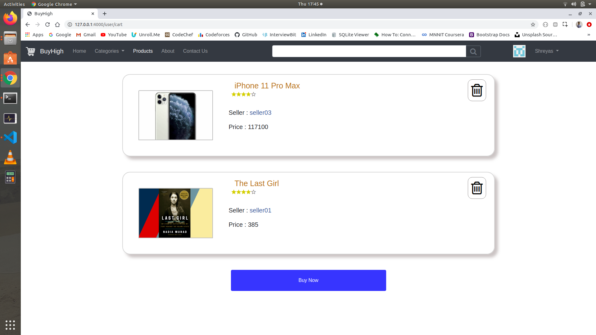

# BuyHigh

Web application for Online Marketplace build using Express.js and MongoDB

**Tech Stack :**
1) Front-end : HTML/CSS + Bootstrap
2) Client-side : Javascript
3) Server-side : Express.js and Node.js
4) Database : MongoDB

**Installation and Setup :**
1) Make sure you already have node installed on your system.
2) Also make sure you have mongod service installed and running.
3) Download Repo to your local repository.
4) Run **npm install** command to install all the dependencies for the project.
5) Finally run **node app.js** command to start the application (make sure mongod service is already running).

**Features :**
1) Create account or user signin
2) Add, Edit or Delete Products 
3) Search by tags, by category, or by seller
4) Rate and Submit Feedback comments 
5) Add / Remove Products to Cart
6) View Order history
7) Maintain user session

**Snapshots :**
1) Home Page

2) Category Page

3) Product Page

4) Review and Comments

5) User Cart Page

